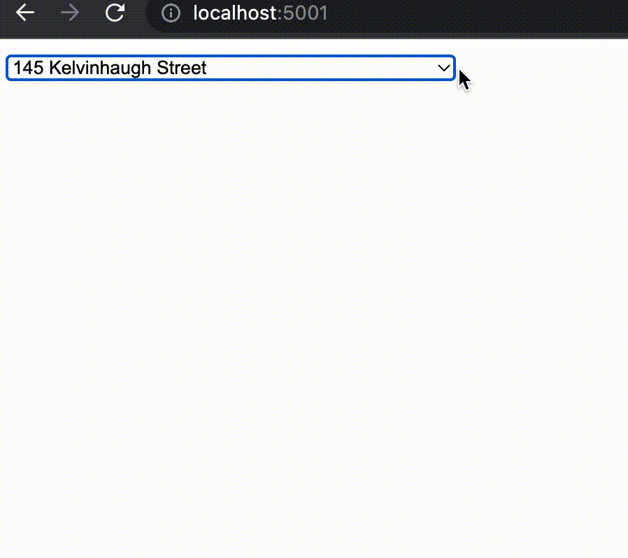
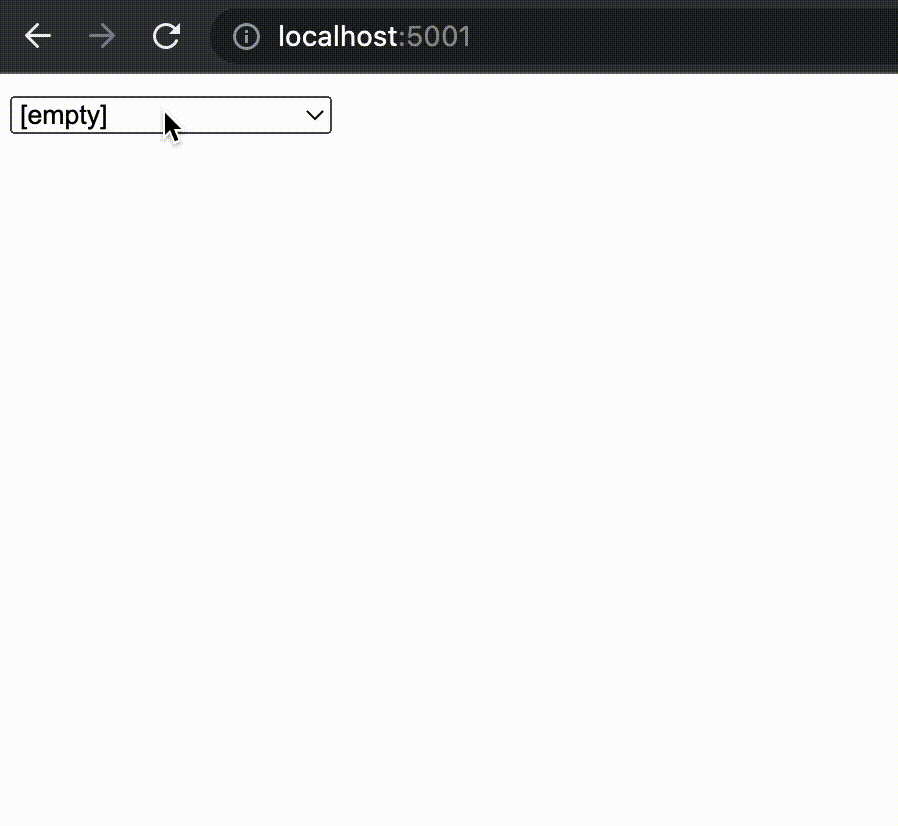

# postcode python node

## goal

this microservice node, return tree formatted mock address data, for front end using.

example:

```
['145 Kelvinhaugh Street']
['115 Kelvinhaugh Street', 'Flat 0/1']
['119 Kelvinhaugh Street', 'Flat 0/1']
['117 Kelvinhaugh Street', 'Flat 0/2']
['119 Kelvinhaugh Street', 'Flat 0/2']
['107 Kelvinhaugh Street', 'Flat 1']
['115 Kelvinhaugh Street', 'Flat 1/1']
['117 Kelvinhaugh Street', 'Flat 1/1']
['119 Kelvinhaugh Street', 'Flat 1/1']
['117 Kelvinhaugh Street', 'Flat 1/2']
['119 Kelvinhaugh Street', 'Flat 1/2']
['107 Kelvinhaugh Street', 'Flat 10']
['107 Kelvinhaugh Street', 'Flat 11']
……
```

usually, raw room address in a same postcode, is like data above.

this kind of data format is awkward, since the `<select>` label
in html, will occupy too wide and too height position like this:



to make data easy to use, the node converts raw data to this tree structured format below:

```
"145 Kelvinhaugh Street": "",
"115 Kelvinhaugh Street": {
    "Flat 0/1": "",
    "Flat 1/1": "",
    "Flat 2/1": "",
    "Flat 3/1": ""
},
"119 Kelvinhaugh Street": {
    "Flat 0/1": "",
    "Flat 0/2": "",
    "Flat 1/1": "",
    "Flat 1/2": "",
    "Flat 2/1": "",
    "Flat 2/2": "",
    "Flat 3/1": "",
    "Flat 3/2": ""
}
……
```

front end can use above data like below:


